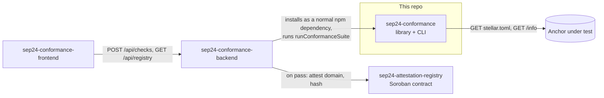
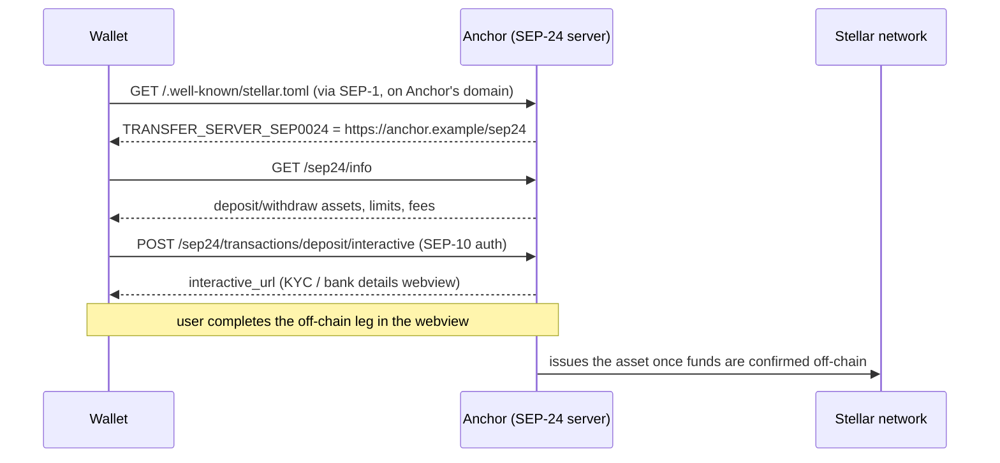
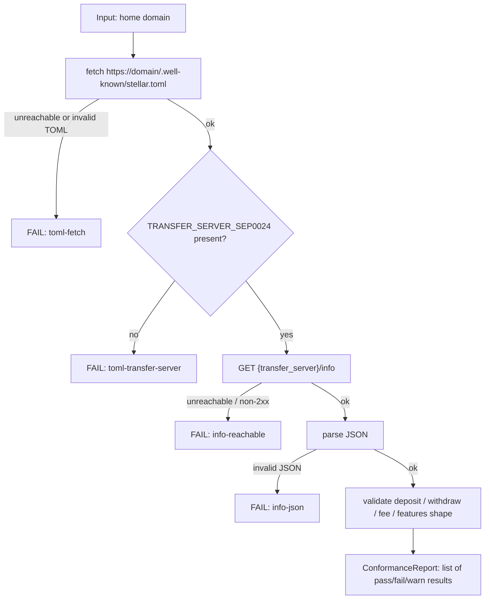
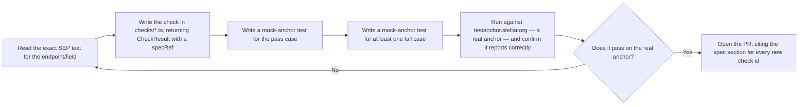

# sep24-conformance

A conformance checker for [SEP-24](https://github.com/stellar/stellar-protocol/blob/master/ecosystem/sep-0024.md)
(interactive deposit/withdraw) anchor implementations on the Stellar
network. Point it at a domain; it tells you exactly where that anchor's
implementation diverges from spec, with a reference back to the relevant
section of the SEP for every failure.

This is the foundational piece of a three-repo project. The other two:

- [`sep24-attestation-registry`](https://github.com/SEP-24-conform/sep24-attestation-registry) — a Soroban contract that stores on-chain, admin-signed records of conformance results produced by this library.
- [`sep24-conformance-backend`](https://github.com/SEP-24-conform/sep24-conformance-backend) — an API service that runs this checker and publishes passing results to that contract.

This repo has no dependency on either of them. It's a standalone library and
CLI that happens to be useful on its own, and is also the shared core the
other two are built on.



## Table of contents

- [Why this exists](#why-this-exists)
- [Glossary](#glossary)
- [Background: what SEP-24 and anchors actually are](#background-what-sep-24-and-anchors-actually-are)
- [How the check works](#how-the-check-works)
- [Installation](#installation)
- [CLI usage](#cli-usage)
- [Library usage](#library-usage)
- [Check reference](#check-reference)
- [Annotated sample /info response](#annotated-sample-info-response)
- [Common ways anchors fail this check](#common-ways-anchors-fail-this-check)
- [How SEP-24 relates to SEP-6 and SEP-31](#how-sep-24-relates-to-sep-6-and-sep-31)
- [Project layout](#project-layout)
- [Architecture decisions](#architecture-decisions)
- [Development](#development)
- [Design notes and a real bug this caught](#design-notes-and-a-real-bug-this-caught)
- [What this doesn't check (yet)](#what-this-doesnt-check-yet)
- [Adding a new check](#adding-a-new-check)
- [FAQ](#faq)
- [Contributing](#contributing)
- [License](#license)

## Why this exists

Stellar's core pitch, going back to the original design of the network, is
cheap and fast settlement for payments and asset issuance — the
[Stellar Consensus Protocol](https://stellar.org/learn/stellar-consensus-protocol)
paper frames the goal explicitly around reducing the cost of everyday
financial transactions and cross-border remittances. But a public ledger
only moves money that's already *on* it. Getting fiat currency onto
Stellar, and back off again, is the job of **anchors**: regulated or
semi-regulated services that hold the off-chain funds and issue or redeem
the corresponding on-chain asset.

SEP-24 is the protocol anchors implement for that on/off-ramp when a human
is present to complete an interactive flow (as opposed to SEP-6, which is
for fully programmatic, non-interactive transfers). It's arguably closer to
Stellar's original reason for existing than most of the application-layer
activity built on top of it — and yet, looking across the current Stellar
Wave ecosystem (see the survey that motivated this project, linked from the
org profile), there is a lot of tooling for escrow apps, payment dashboards,
and DeFi primitives, and very little for the anchor layer itself. No public,
independent way to check "does this anchor's `/info` endpoint actually
match the spec?" existed before this.

That's the gap this fills. It's small and unglamorous by design — a
conformance checker doesn't need to be big to be useful, and scope creep
here would just make it harder to trust.

## Glossary

Terms used throughout this README, for readers new to the Stellar ecosystem
tooling vocabulary:

| Term | Meaning |
|---|---|
| **SEP** | Stellar Ecosystem Proposal — a numbered specification document in the [stellar-protocol](https://github.com/stellar/stellar-protocol) repo, analogous to a Bitcoin BIP or Ethereum EIP. |
| **Anchor** | A service that bridges Stellar and traditional finance: it accepts fiat (or another off-chain asset) and issues the corresponding Stellar asset, or the reverse. |
| **Home domain** | The domain a wallet/app uses to discover an entity's Stellar-related metadata, by fetching `stellar.toml` from it. Not necessarily the anchor's own operating domain — it's whatever domain the *user* associates with the service. |
| **Transfer server** | The base URL of an anchor's SEP-24 (or SEP-6) HTTP API, advertised via `TRANSFER_SERVER_SEP0024` in `stellar.toml`. |
| **Interactive flow** | The webview-based deposit/withdraw process SEP-24 defines, where a human completes steps like KYC or entering bank details in a page hosted by the anchor. |
| **SEP-10** | The challenge-response authentication scheme wallets use to prove control of a Stellar account to an anchor, without exposing a private key. |
| **Soroban** | Stellar's smart contract platform. Relevant here only because [`sep24-attestation-registry`](https://github.com/SEP-24-conform/sep24-attestation-registry) is a Soroban contract — this repo itself has no on-chain component. |
| **Conformance** | In this project specifically: whether an anchor's `stellar.toml` and SEP-24 `/info` response match the literal text of the relevant SEPs. It says nothing about whether the anchor's interactive flow, KYC process, or settlement actually works correctly. |

## Background: what SEP-24 and anchors actually are

If you already know this, skip to [How the check works](#how-the-check-works).

An anchor is a bridge between the Stellar network and traditional finance.
Concretely:

1. A wallet or app discovers an anchor's capabilities by fetching
   `https://<domain>/.well-known/stellar.toml` — a well-known file defined
   by [SEP-1](https://github.com/stellar/stellar-protocol/blob/master/ecosystem/sep-0001.md)
   that advertises, among other things, where the anchor's SEP-24 server
   lives (`TRANSFER_SERVER_SEP0024`).
2. The wallet calls that server's `GET /info` endpoint to learn which
   assets can be deposited or withdrawn, their limits, and fee structure.
3. To actually move funds, the wallet opens the anchor's hosted interactive
   flow in a webview (a KYC form, a bank transfer instruction page,
   whatever the anchor needs), authenticated via a
   [SEP-10](https://github.com/stellar/stellar-protocol/blob/master/ecosystem/sep-0010.md)
   challenge-response signature — proving the user controls the Stellar
   account without ever sharing a private key with the anchor.
4. The anchor issues (for a deposit) or redeems (for a withdrawal) the
   asset on Stellar once the off-chain leg completes.



Everything in steps 1 and 2 is static, unauthenticated, and independently
verifiable by anyone — which is exactly what makes it checkable by a tool
like this one without needing any special access or a real user session.

## How the check works



Every result carries a stable `id`, a human-readable `description`, a
`status` of `pass` / `fail` / `warn`, an optional `message` explaining a
failure, and a `specRef` URL pointing at the exact document the rule comes
from. Nothing is checked that isn't traceable to spec text — see
[Check reference](#check-reference) for the full list with citations.

## Installation

```sh
npm install -g sep24-conformance
```

Or run it without installing:

```sh
npx sep24-conformance check testanchor.stellar.org
```

## CLI usage

```sh
sep24-conformance check <homeDomain> [--json]
```

Example, against SDF's own reference test anchor:

```console
$ sep24-conformance check testanchor.stellar.org
SEP-24 conformance report for testanchor.stellar.org
Transfer server: https://testanchor.stellar.org/sep24

✔ [PASS] stellar.toml is reachable and valid TOML
✔ [PASS] stellar.toml declares TRANSFER_SERVER_SEP0024
✔ [PASS] GET /info is reachable
✔ [PASS] /info returns valid JSON
✔ [PASS] deposit is present and every asset entry has a valid shape
✔ [PASS] withdraw is present and every asset entry has a valid shape
✔ [PASS] fee.enabled is a boolean when fee is present
✔ [PASS] features fields have correct types

8 passed, 0 failed, 0 warnings
```

`--json` emits the same data as machine-readable JSON (see
[`ConformanceReport`](#conformancereport) below) and the process exits
non-zero if any check failed — usable directly as a CI gate in an anchor's
own repo, catching spec regressions before they ship.

## Library usage

```ts
import { runConformanceSuite, formatText } from "sep24-conformance";

const report = await runConformanceSuite("testanchor.stellar.org");
console.log(formatText(report));

if (report.results.some((r) => r.status === "fail")) {
  process.exitCode = 1;
}
```

### Exports

| Export | Kind | Description |
|---|---|---|
| `runConformanceSuite(homeDomain: string)` | function | Runs the full suite: resolves `stellar.toml`, locates the transfer server, runs all `/info` checks. Returns a `ConformanceReport`. |
| `fetchStellarToml(homeDomain: string)` | function | Fetches and parses just the SEP-1 `stellar.toml`. Accepts a bare domain or a full `http(s)://` base (the latter is what the test suite uses against a local mock anchor). |
| `checkInfoEndpoint(transferServerUrl: string)` | function | Runs only the `/info` shape checks against an already-known transfer server URL. |
| `formatText(report)` / `formatJson(report)` | function | Renders a `ConformanceReport` as a human-readable string or JSON. |
| `StellarTomlError` | class | Thrown by `fetchStellarToml` on network failure, non-2xx response, or invalid TOML. |
| `CheckResult`, `ConformanceReport`, `CheckStatus`, `StellarToml` | types | See below. |

### `ConformanceReport`

```ts
interface ConformanceReport {
  homeDomain: string;
  transferServer?: string;      // absent if stellar.toml resolution failed
  results: CheckResult[];
}

interface CheckResult {
  id: string;                   // stable identifier, e.g. "deposit-USD-enabled"
  description: string;          // human-readable statement of what was checked
  status: "pass" | "fail" | "warn";
  message?: string;             // present on fail/warn, explains what's wrong
  specRef: string;               // URL into the relevant SEP document
}
```

## Check reference

| id | Checks | Spec |
|---|---|---|
| `toml-fetch` | `stellar.toml` is reachable at `/.well-known/stellar.toml` and parses as valid TOML | [SEP-1](https://github.com/stellar/stellar-protocol/blob/master/ecosystem/sep-0001.md) |
| `toml-transfer-server` | `TRANSFER_SERVER_SEP0024` field is present in `stellar.toml` | [SEP-24](https://github.com/stellar/stellar-protocol/blob/master/ecosystem/sep-0024.md) |
| `info-reachable` | `GET {transfer_server}/info` returns a 2xx response | SEP-24 §Info Endpoint |
| `info-json` | The response body is valid JSON | SEP-24 §Info Endpoint |
| `deposit-shape` | `deposit` is an object with at least one asset entry | SEP-24 §Info Endpoint |
| `deposit-<CODE>-enabled` | Each deposit asset has a boolean `enabled` field | SEP-24 §Info Endpoint |
| `deposit-<CODE>-{min_amount,max_amount,fee_fixed,fee_percent,fee_minimum}` | If present, each of these fields is a number | SEP-24 §Info Endpoint |
| `withdraw-shape` | `withdraw` is an object with at least one asset entry | SEP-24 §Info Endpoint |
| `withdraw-<CODE>-enabled` / numeric fields | Same shape rules as deposit | SEP-24 §Info Endpoint |
| `fee-shape` | If `fee` is present, `fee.enabled` is a boolean | SEP-24 §Info Endpoint |
| `features-shape` | If `features` is present, `account_creation` / `claimable_balances` are booleans when set | SEP-24 §Info Endpoint |

A `warn` (rather than `fail`) is emitted for `deposit-shape` / `withdraw-shape`
when the object exists but lists zero assets — technically not invalid per
spec, but almost certainly not what an anchor operator intends.

## Annotated sample /info response

This is the shape a fully conformant response takes, annotated field by
field. It's close to what `testanchor.stellar.org` actually returns.

```jsonc
{
  "deposit": {
    "USDC": {
      "enabled": true,          // required: boolean
      "min_amount": 1,          // optional: number
      "max_amount": 10000,      // optional: number
      "fee_fixed": 0,           // optional: number, flat fee in the asset
      "fee_percent": 0          // optional: number, percentage fee
    }
  },
  "withdraw": {
    "USDC": {
      "enabled": true,
      "min_amount": 1,
      "max_amount": 10000
      // note: no `types` field here — that's a SEP-6 concept, not SEP-24.
      // See "Design notes" below for the bug this distinction caught.
    }
  },
  "fee": {
    "enabled": false            // if present, must be a boolean
  },
  "features": {
    "account_creation": true,      // optional: boolean
    "claimable_balances": false    // optional: boolean
  }
}
```

Every key this tool inspects is shown above. Anything else an anchor
includes in its `/info` response (extra metadata, undocumented extensions)
is ignored rather than flagged — this checker validates conformance to
what SEP-24 requires, not strict adherence to a closed schema.

## Common ways anchors fail this check

Patterns worth watching for when building or debugging an anchor's `/info`
endpoint, based on what the check logic in `checks/info.ts` actually
guards against:

| Symptom | Likely cause |
|---|---|
| `toml-transfer-server` fails | `stellar.toml` is served, but doesn't declare `TRANSFER_SERVER_SEP0024` — often because only the SEP-6 field (`TRANSFER_SERVER`) was set, or the anchor only supports non-interactive transfers. |
| `info-reachable` fails with a 404 | The path in `TRANSFER_SERVER_SEP0024` doesn't match where the server actually mounts its routes — a common copy-paste error when the transfer server value is set to a bare domain instead of a full path like `https://domain/sep24`. |
| `deposit-<CODE>-enabled` fails | The asset entry omits `enabled` entirely rather than setting it `false` — some frameworks silently drop keys with `undefined` values during JSON serialization. |
| A numeric field check fails | Amounts serialized as strings (`"10000"` instead of `10000`) — easy to introduce when values come from a database or environment variable without an explicit cast. |
| `features-shape` fails | `account_creation` or `claimable_balances` set to a string like `"true"` instead of a boolean, or to `1`/`0`. |

None of these are hypothetical edge cases invented for this table — they're
the direct, literal failure conditions this tool's checks are written to
catch, per the [Check reference](#check-reference) above.

## How SEP-24 relates to SEP-6 and SEP-31

Anchors implement different SEPs depending on how funds move:

| SEP | Flow | Human interaction | Typical use |
|---|---|---|---|
| [SEP-6](https://github.com/stellar/stellar-protocol/blob/master/ecosystem/sep-0006.md) | Programmatic deposit/withdraw | None — fully API-driven | Exchanges, automated integrations |
| **SEP-24** (this repo) | Interactive deposit/withdraw | Webview for KYC / bank details | Wallet apps with a human user present |
| [SEP-31](https://github.com/stellar/stellar-protocol/blob/master/ecosystem/sep-0031.md) | Direct cross-border payment between anchors | None on the sending side | Remittance corridors between two anchors, no end-user wallet involved |

This project only covers SEP-24. The `/info` response shapes for SEP-6 and
SEP-24 are similar but not identical (see the `types` field discussion in
[Design notes](#design-notes-and-a-real-bug-this-caught)) — treating them
as interchangeable is the single most common source of confusion when
implementing or checking either one.

## Project layout

```text
src/
  toml.ts          SEP-1 stellar.toml fetch + parse
  checks/info.ts    SEP-24 /info shape validation
  report.ts         text/JSON report formatting
  index.ts          library entry point (runConformanceSuite + re-exports)
  cli.ts            commander-based CLI
test/
  toml.test.ts
  checks/info.test.ts
  fixtures/mock-anchor.ts   real HTTP server on loopback, used instead of
                             mocking fetch — tests exercise actual network
                             + parsing code paths
```

## Architecture decisions

A few choices that weren't the only option, and why they were made:

**Hand-rolled shape validation instead of a schema library (zod, ajv,
etc.).** A schema library would shrink `checks/info.ts` considerably. The
trade-off: schema validators report "expected X, got Y" against the
schema, not against the spec. Because every failure in this tool needs to
carry a specific `specRef` and a message an anchor operator can act on
directly, hand-written checks that build exactly that message won this
trade — for now. If check coverage grows substantially (the full
interactive-flow endpoints, say), this may need revisiting.

**A real HTTP server in tests instead of mocking `fetch`.** Mocking
`fetch` verifies that the code calls `fetch` with the right arguments and
handles whatever the mock is told to return. It cannot catch a bug in how
a *real* HTTP response — real headers, real chunked encoding, a real JSON
parse — gets handled, and the SEP-6/SEP-24 `types` bug documented below is
exactly the kind of issue a mock would never have surfaced (it was caught
by testing against SDF's real anchor, not by unit tests at all). The test
fixtures spin up an actual `node:http` server on loopback instead.

**No dependency on `sep24-attestation-registry` or
`sep24-conformance-backend`.** This library works standalone and is
published so other projects (anchor test suites, CI pipelines, other
tooling) can depend on just the checking logic without pulling in the
Soroban contract client or an HTTP framework they don't need.

## Development

```sh
npm install
npm run build     # tsc -> dist/
npm test          # vitest, runs against the local mock anchor
npm run dev       # tsx src/cli.ts, for iterating without a build step
```

The test suite (11 tests) never touches the network beyond loopback — it
spins up a real `node:http` server per test rather than mocking `fetch`, on
the theory that a mocked fetch can't catch a bug in how a real HTTP
response gets parsed. Separately, every change to the checks in
`checks/info.ts` gets manually re-verified against SDF's live
`testanchor.stellar.org` before being trusted — see the next section for
why that step matters.

## Design notes and a real bug this caught

Worth documenting honestly, because it's the best illustration of why this
tool needs to exist and why it needs to be trustworthy rather than just
plausible-looking.

The first implementation of the withdraw-asset checks required a `types`
field on every enabled withdraw asset — modeled, it turns out, on SEP-6's
`/info` response shape, not SEP-24's. SEP-6 in fact does *not* require a
`types` field either — the mistake was importing an assumption from a
similar-sounding but different spec, then not verifying it against the SEP-24
text carefully enough on the first pass.

Running the checker against `testanchor.stellar.org` — SDF's own reference
implementation — surfaced this immediately: it flagged SDF's anchor as
non-conformant. Since an SDF-run reference anchor being wrong is a much
lower-probability event than a fresh implementation of a spec-checker being
wrong, that was the signal to go re-read the actual SEP-24 markdown source
rather than trust the first draft. The `types` requirement doesn't appear
anywhere in SEP-24's `/info` section; it was removed, and the anchor now
correctly reports as fully conformant.

The takeaway that shaped how this project is built: **a conformance tool
that's occasionally wrong about the spec is worse than useless** — it
actively misleads anchor operators into "fixing" things that aren't
broken. Every check in this repo is written against the literal SEP-24
markdown text, and every change gets re-validated against a real, known-good
anchor before being trusted, not just unit-tested against a mock that
encodes the same assumption as the code under test.

## What this doesn't check (yet)

Only the unauthenticated `GET /info` endpoint is covered today. The
interactive-flow endpoints — `POST /transactions/deposit/interactive`,
`POST /transactions/withdraw/interactive`, `GET /transactions`,
`GET /transaction` — all require a SEP-10 authenticated session and are the
natural next scope. That's tracked as an open issue in this repo rather
than promised here as a roadmap item with no commitment behind it.

## Adding a new check

The interactive-flow endpoints (see above) are the clearest place to
contribute. The pattern every existing check follows:



Concretely:

1. Add a new file under `src/checks/` (or extend an existing one) following
   the pattern in `checks/info.ts`: small helper functions (`pass`, `fail`,
   `warn`) that build a `CheckResult` with a `specRef`.
2. Add fixtures and tests in `test/checks/` using `startMockAnchor` from
   `test/fixtures/mock-anchor.ts` — cover at least one passing case and one
   failing case per new check id.
3. Wire the new checks into `runConformanceSuite` in `src/index.ts` if
   they're not already reachable from there.
4. Before opening a PR: run the CLI against `testanchor.stellar.org` (or
   another anchor you know the correct expected result for) and confirm
   the new check reports what you expect. This step is not optional — see
   [Design notes](#design-notes-and-a-real-bug-this-caught) for why.
5. In the PR description, cite the exact section of the SEP the new check
   enforces. A check without a traceable spec citation won't be merged.

## FAQ

**Does this check that an anchor's interactive flow actually works, end to
end?** No. It checks that the anchor's static, unauthenticated surface
(`stellar.toml` + `/info`) matches spec. A conformant `/info` response is
necessary but not sufficient for a working anchor — see
[What this doesn't check](#what-this-doesnt-check-yet).

**Why not just use the official Stellar Anchor Validator / reference
tooling if one exists?** If SDF or the ecosystem already maintains an
authoritative validator, that's worth checking before relying on this one
for anything load-bearing — corrections and pointers are welcome via an
issue. This project was built because no such public, independently
runnable tool was found at the time, not on the assumption none could
possibly exist.

**Can I use this against a mainnet anchor?** Yes — it only ever makes
read-only HTTP GET requests to the anchor's own public endpoints. Nothing
here writes anything or requires credentials.

## Contributing

Issues are scoped to real, currently-unimplemented spec coverage (see
[What this doesn't check](#what-this-doesnt-check-yet)) or corrections to
existing checks backed by a specific SEP-24 citation. A PR that changes a
check's behavior should explain, with a link to the spec text, why the old
behavior was wrong — the story in
[Design notes](#design-notes-and-a-real-bug-this-caught) is the standard to
match.

## License

Apache-2.0
